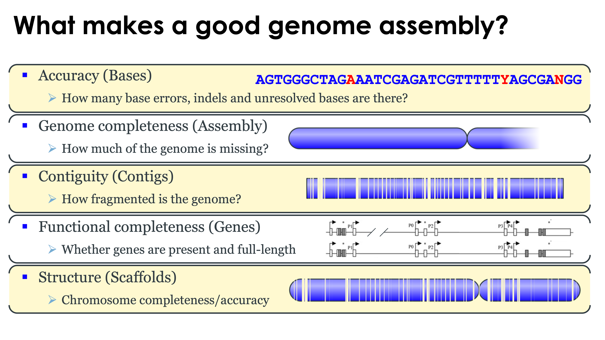
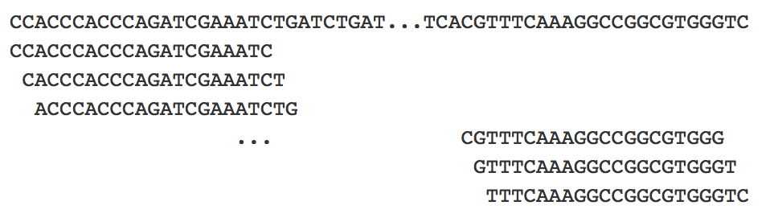
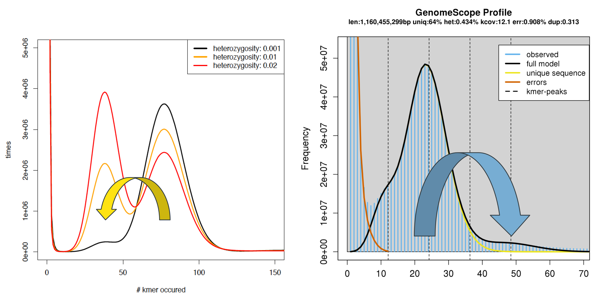
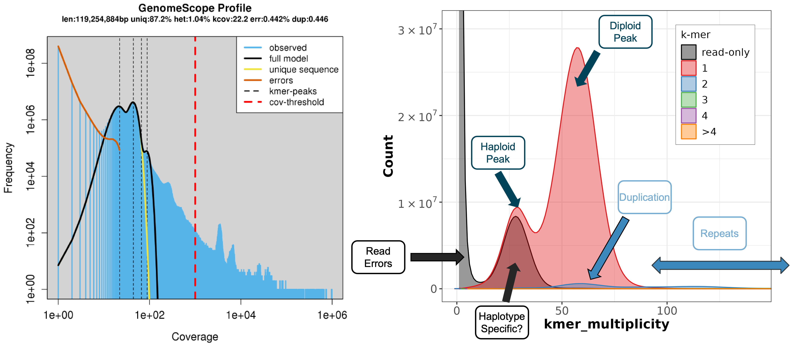
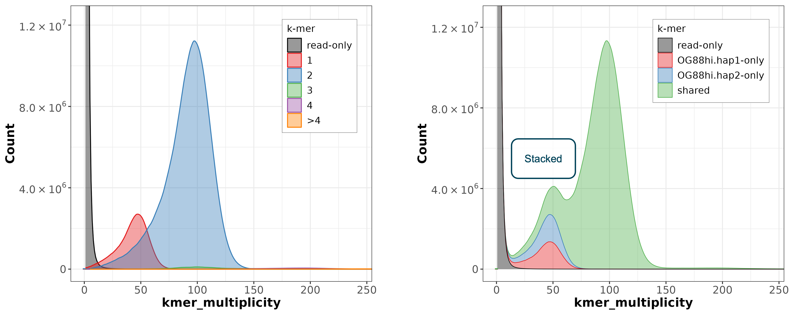
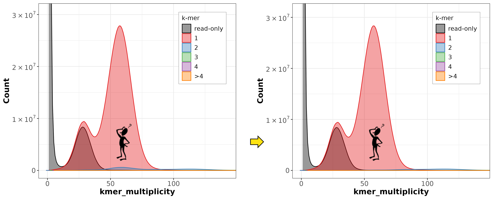
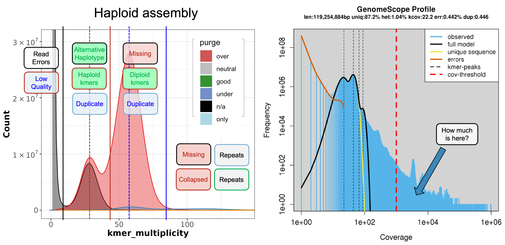
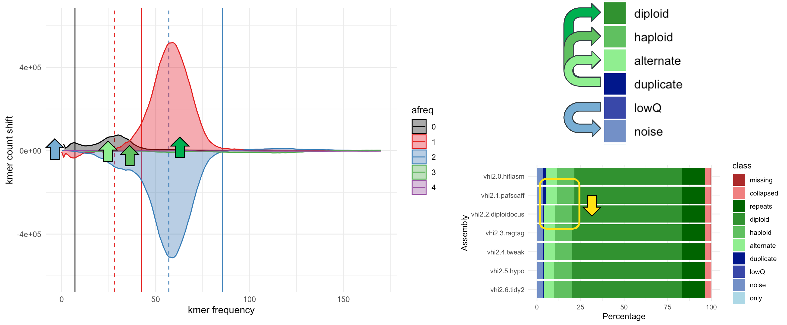
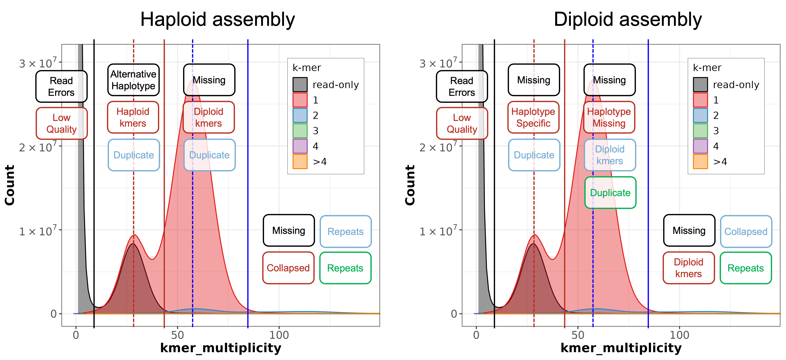
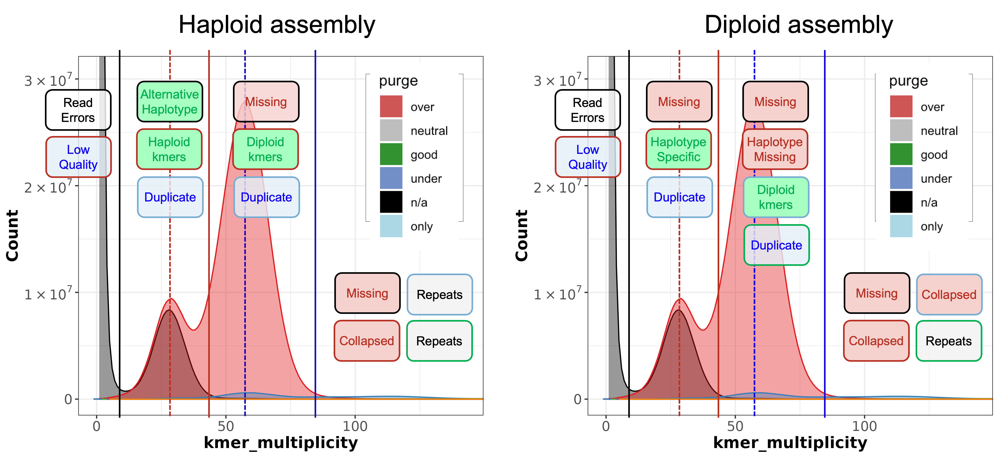

# Introduction

This tutorial is designed to cover the basics of the main `MerquryRising.Rmd` markdown script. Following this initial commit, the two Rmd files will be edited in parallel to make the main Rmd more functional, and this Rmd have more information. Core functions have been moved to the `merquryrising.R` script, which can be run as a standalone Rscript to make the basic figures and tables without the extra fluff.


**NOTE:** This Tutorial is a work in progress. Please refer to the main Rmd file and post questions on GitHub in the meantime.

## Genome assembly assessment criteria

The ultimate goal of a genome assembly is to generate a complete and correct representation of the sequenced genome. It is therefore useful to consider and assess the following attributes of a genome assembly ([Fig1](figures/tutfig00.png)):

1. Accuracy (Bases).
2. Genome completeness (Assembly).
3. Contiguity (Contigs).
4. Functional completeness (Genes).
5. Structural accuracy (Scaffolds).


<font color="blue">**Figure 1. What makes a good genome assembly?** Key genome attributes to assess during assembly QC.</font>


Here, we are mostly considering **Base Accuracy** and **Genome Completeness**. Notably, this includes  _false duplications_, where one region of the genome is present multiple times in the assembly. Typically, this arises through heterozygous diploid haplotypes being incorrectly identified as two different loci. At the opposite end of the spectrum, parts of the genome might be _collapsed_ (represented by fewer copies in the assembly than the true genome) or missing entirely.

## Kmers

One common approach to analysing genome sequencing is to use kmers. Kmers are simply substrings of length _k_. For DNA, kmers are chunks of *k* nucleotides ([Fig2](figures/tutfig01.png)). For any given DNA sequence, there will be a kmer starting at every position in the sequence except the last _k_-1 kmers. For long sequences, such as vertebrate genomes, the total kmer count therefore tends towards the sequence length. However, not all kmers will be unique. Where repetitive sequences exist, the same kmer sequence may appear several times.



<font color="blue">**Figure 2. Kmers.** Example kmers for an invented DNA string (k=21).</font>


## Kmer distributions (e.g. GenomeScope)

In addition to breaking a genome assembly, the raw sequencing data can similarly be broken down into kmers. In this case, it is expected for kmers to appear multiple times, as each region of the genome will have been sequenced multiple times. Such data is often described or plotted as a **kmer distribution** ([Fig3](figures/tutfig02.png)). Here, _kmer counts_ (the number of _different kmers_ that occur) are plotted against _kmer multiplicity_ or _coverage_ (the number of time the _same_ kmer sequence is observed). This is akin to plots of numbers of bases against read depth.



<font color="blue">**Figure 3. Kmer distributions.** Example GenomeScope kmer distributions from GenomeScope. Left panel, heterozygosity moves kmers from the diploid coverage peak to a haploid coverage peak at half the multiplicity level. Right panel, </font>

**Heterozygosity.** For unique haploid or homozygous diploid genomes, one would expect a single dominant kmer peak, corresponding to the average number of times a part of the genome was sequenced (approx. the sequencing depth for long reads). For heterozygous diploid genomes, each SNP between haplotypes will move _k_ kmers from the diploid peak and add _2k_ kmers to the haplod peak at half the coverage ([Fig3, left](figures/tutfig02.png)). This is because each SNP sits in _k_ kmers at different positions, and each will now have two different versions at approximately half the multiplicity.

**Repeats.** Repetitive sequences move kmers in the opposite direction. kmers in repeats will shift into the higher multiplicity section of the plot. Duplicated loci will have a peak at approx. double the diploid peak, whilst more frequent repeats can have very high kmer multiplicity values.


## Merqury plots and statistics

Merqury is a freely available tool ([Fig4](figures/tutfig04.png)) for comparing the kmer distributions from genome assemblies and raw reads. One of the primary uses of Merqury is to assess the **kmer completeness** and base error rate (translated into a Quality Value (**QV**)) based on comparing the different kmers found in the raw reads with those found in the assembly (see [Merqury paper](https://genomebiology.biomedcentral.com/articles/10.1186/s13059-020-02134-9) and [Gitub](https://github.com/marbl/merqury) for more details). These can be found in the `*.qv` and `*.stats` output files. Whilst not the focus of MerquryRising, these files can be loaded and incorporated into the summary tables (see below). Merqury will aslo generate kmer distribution plots, which can be used to assess whether the genome assembly is accurately representing the genome itself. This is what MerquryRising is designed to assist with.


<font color="blue">**Figure 4. Merqury.** Merqury is freely available on GitHub and has been published in Genome Biology.</font>

### Merqury Plots

Merqury  generates similar kmer plots to GenomeScope, but with the important addition that the kmers in the raw reads are classified according to how many times they appear in the assembly ([Fig5](figures/tutfig03.png)):

* **Sequencing errors** will move _k_ kmers for each error into the low coverage "read-only" part of the plot ([Fig5](figures/tutfig03.png), right (black)). These will tend to be unique, hence there will be a _very_ large number of different kmers, typically off the scale.
* Kmers that appear once in the assembly ([Fig5](figures/tutfig03.png), right (red)) will generally represent heterozygous (haploid coverage) or homozygous (diploid coverage) unique regions of the genome, generating a **Hapoid Peak** and a **Diploid Peak**.
* A haploid representation of a diploid genome should only have one allele for each heterozygous unique kmer, with the other alleles visible in the Merqury plot as a **Haplotype Specific** peak of **read-only** kmers.
* Falsely **Duplicated** regions in the assembly (e.g. where both alleles have been put in the same haplotype) will generate kmers that match the Diploid Peak in the raw data, but occur twice in the assembly ([Fig5](figures/tutfig03.png), right (blue)).
* **Repeats** should occur more than once in the assembly and will have a kmer coverage that exceeds the Diploid Peak.



<font color="blue">**Figure 5. GenomeScope and Merqury plots.** Kmers drawn from parts of the genome assembly with different attributes will contribute to different parts of the kmer distribution.</font>


### Diploid Merqury Plots

Merqury can also be run in a Diploid mode ([Fig6](figures/tutfig06.png)), co-analysing the kmer distributions of both haplotypes. Here, the kmer counts in the assembly should match the predicted ploidy of the peaks ([Fig6](figures/tutfig06.png), left). Merqury can also plot kmers that are shared between the two haplotypes ([Fig6](figures/tutfig06.png), right).



<font color="blue">**Figure 6. Diploid Merqury plots.** Note that the plot on the left superimposes the individual assembly-count distributions over each other, whereas the right plot is a _stacked_ kmer frequency.</font>


## Quantifying and comparing kmer distributions with MerquryRising

Whilst incredibly useful, there are some limitations with relying on the Merqury plots to assess whether a genome assembly needs purging of false duplicates, or whether changes to a genome assembly have made things better or worse. Visual assessment of plots lacks automation and reproducibility, whilst it can be challenging to compare two plots and understand what has changed and how ([Fig7](figures/tutfig10.png)). Because the total number of kmers represented is the product of both axes, it can be hard to intuitively assess how much of the assembly is captured by each peak. Furthermore, the high-coverage repetitive regions are not plotted ([Fig5](figures/tutfig03.png), [Fig8](figures/tutfig09.png)). 


<font color="blue">**Figure 7. Comparing Merqury plots.** In this example, purging has reduced the small diploid-coverage peak of kmers represented twice in the genome, which probably represent false duplicates. However, it is not clear how much this reduction equates too, nor whether it has been balanced by loss of good kmers from elsewhere in the distribution.</font>


MerquryRising seeks to overcome these challenges in two ways. First, kmers are classified according to their multiplicity in both the raw reads and the assembly ([Fig8](figures/tutfig09.png), see details in later sections), and each kmer class quantified using both its multiplicity and kmer count. 


<font color="blue">**Figure 8. MerquryRising classification.** MerquryRising assigns kmers to purging classes based on their frequency in both the assembly and the raw read data (left). Quantification of kmers includes the long tail of repeat kmers (right).</font>


Second, MerquryRising will generate pairwise comparisons between assemblies to identify how kmers have moved between classes in response to purging or gap-filling etc. ([Fig9](figures/tutfig11.png)). These are explored in more detail in the next section. An example MerquryRising run can also be found in the accompanying [MerquryRising.html](./MerquryRising.html) file.


<font color="blue">**Figure 9. Comparative MerquryRising plots.** MerquryRising will convert a Merqury plot into a kmer distribution difference versus a different version of the assembly (left panel) and plot kmer classes across multiple assembly versions (right panel) to help assess the effects of assembly manipulations.</font>


# MerquryRising

```{r rmd, message=FALSE, warning=FALSE, include=FALSE}
knitr::opts_chunk$set(echo = FALSE, include = TRUE, warning=FALSE, message=FALSE)
# HISTORY
# - See main Rmd and R scripts.

# NOTES
#!# Consider setting results='asis' to avoid wrapping in ```.
#?# I wonder if this is the solution for HTML output within loops?

#i# Set defaults for the Rmd implementation that might be different from the standalone version
override <- c('fullrun=FALSE','rdir=.')
source('./merquryrising.R')
```

This section provides additional details and background to the MerquryRising workflow.


## MerquryRising workflow

The general `MerquryRising` workflow is as follows:

1. Load run settings from `merquryrising.config` file and (optionally) assembly labels/order from `merquryrising.fofn`. Establish list of input assembly files and build alias list (`G1` to `Gn`).
2. Load and integrate kmer frequencies from the `*.spectra-cn.hist` and `*.only.hist` into tibbles with 3 fields: `afreq` (kmer frequency in assembly), `rfreq` (kmer frequency in reads) and `knum` (number of different kmers). Load `*.qv` and `*.stats` files if present.
3. Use the kmer distributions or raw read ploidy file to establish the kmer multiplicity boundaries representing kmers from different ploidy levels.
4. Use the ploidy boundaries to generate kmer classes based on `afreq` and `rfreq`.
5. Sum up total kmers within each classes by multiplying `knum` by `rfreq` and then convert into a percentage.
6. Tabulate and plot kmer classes for all assemblies.
7. Convert kmer distributions in comparative distributions relative to either a specified reference assembly, or relative to the previous assembly.
8. Tabulate and plot relative kmer distributions and classes.

These steps are expanded, below.


## Input files for MerquryRising

The main input for MerquryRising is the set of `*.spectra-cn.hist` and corresponding `.only.hist` files, with optional `qv/*.merqury.qv` and `stats/*.merqury.completeness.stats` files. The latter are matched on the `name` field, which is parsed from the `*.spectra-cn.hist` and split on `.merqury.`. (See the example data if unclear.)

Optionally, assembly names will be mapped from the `labels=FILE`, otherwise the label will be the "G" number, `G1` to `Gn`. MerquryRising will report the  input files and assemblies recognised for this run in a table:

```{r set_files}
#i# Creation is now handled in the R script.
# D$adb <- setInputFiles()
#i# Summarise the input data table
if(settings$debug){
  kable(D$adb, "html", caption = "Input genome assemblies and QV/completeness stats.", align = "l") %>% kable_styling("striped", full_width = F)  
}else{
  kable(D$adb %>% select(-file,-ofile), "html", caption = "Input genome assemblies and QV/completeness stats.", align = "l") %>% kable_styling("striped", full_width = F)
}
```

where:

* **G** = Arbitrary assembly label.
* **label** = Loaded assembly label from `*.fofn` file.
* **name** = Assembly name parsed from `*.hist` file name.
* **hist** = whether the `*.hist` file was found.
* **only** = whether the `*.only.hist` file was found.
* **qv** = QV score loaded from `*.qv` file (`NA` if missing).
* **completeness** = Completeness score loaded from `*.stats` file (`NA` if missing).
* **base** = merqury results `basename` for that assembly.


## Setting ploidy boundaries

The next step is set the ploidy boundaries that establish `rfreq` categories as `low`, `haploid`, `diploid` or `high` frequencies. Assembly-only kmers are classified as `only`. Ploidy boundaries can be set for all assemblies using the `boundary` values loaded from the `ploidy` file. However, but these appear to be quite conservative and result in a lot of kmers being rated as over- or under-purged based on the merqury plots themselves, with a lot of the main distributions broader than the values loaded. Ploidy boundaries are therefore set by default to be determined from the histograms themselves. For consistent boundaries, provide a single `*.hist` file to the `ploidy=FILE` setting.

When `*.hist` files are used (assembly-specific or general), the diploid peak is first identified as the kmer density peak for rfreq values up to 1000. The boundaries are then calculated based on this `diploid` peak:

* `haploid` frequency is set to half `diploid`.
* The `low` boundary is set to the _maximum_ value of 5, or 0.25 `haploid`. Upto this value of `rfreq` (raw read kmer frequency), kmers are rated `low`. This is plotted as a solid black line on the Comparative Merqury plots.
* The `mid` boundary is set to halfway between `haploid` and `diploid`. Raw kmer frequencies above the `low` boundary and upto the `mid` boundary `hap`. This is plotted as a solid red line on the Comparative Merqury plots, with the haploid peak a dotted red line.
* The `high` boundary is set to 1.5 `diploid`. Raw kmer frequencies above the `hap` boundary and upto the `high` boundary are rated `dip`. This is plotted as a solid blue line on the Comparative Merqury plots, with the diploid peak a dotted blue line.
* Above the `high` boundary, kmers are rated as `high`.


```{r load_ploidy, echo=FALSE}
#i# Optional loading of the ploidy file or generic ploidy boundaries are now handled in the main R script.

if(nrow(D$ploidy) > 0){
  kable(D$ploidy, "html", caption = "Ploidy boundaries for all assemblies, loaded from ploidy file.", align = "l") %>% kable_styling("striped", full_width = F)
}
if(nrow(D$boundary) > 0){
  kable(D$boundary, "html", caption = "Ploidy boundaries for all assemblies.", align = "l") %>% kable_styling("striped", full_width = F)
}
```


```{r loadhist, include=FALSE}
#i# All the tables are now elements of the D list, e.g. D$Tab1, D$Tab2 etc.
# - Load the `*.spectra-cn.hist` data tables into tibbles with 3 fields: `afreq` (kmer frequency in assembly), `rfreq` (kmer frequency in reads) and `knum` (number of different kmers).
D <- makeTab1(D)  #i# Main code moved to the Rscript.
```

```{r boundaries, echo=FALSE}
# Display boundaries loaded from the individual distributions
if(nrow(D$boundary) > 0){
  kable(D$boundary, "html", caption = "Ploidy boundaries.", align = "l") %>% kable_styling("striped", full_width = F)
}
#logWrite(names(D))
```


```{r Table2}
# - Convert `Table1` into a version of all values relative to reference. [`Table2`]
#i# If settings$reference is `default`, will use the previous genome as the reference in each case
#i# Otherwise, will compare all to a specific reference
D <- makeTab2(D)
```


```{r Table3}
# - Convert `Table1` into a long version [`Table3`] -> `knum` and `assembly`.
D <- makeTab3(D)
# `Table3` should now have haploid- and diploid-specific ratings.
```


**NOTE:** For very heterozygous genomes, where the haploid peak exceeds the diploid peak, the diploid peak calculation will break. For these, it is advised to make and load a `*.ploidy` file to use for all assemblies.

**NOTE:** The classification percentages are ultimately defined by the ploidy boundaries, which do not fully capture the extent of each sub-distribution of kmers. As a consequence, there will always be a degree of mis-assigned kmers. For this reason, percentages are best considered as comparative values rather than absolute values.


## MerquryRising kmer classification

Kmer classes are assigned based on the read frequency (`rfreq`) and assembly frequency (`afreq`), ploidy boundaries (above), and whether the assembly is haploid or diploid. This can be specified for all assemblies, else any assemblies with a `.dip` suffix will be treated as diploid (and everything else haploid). Classification is first based on more specific categories, which are then grouped into broader purge categories (described below). 

The full list of classifications is given below, with the detailed `class` and higher-level `purge` ratings that get assigned to each `afreq`-`rfreq` combination. The `dipclass` and `dippurge` ratings are used for diploid assemblies. Ratings and definitions are described in more detail in the following sections.


```{r dipkmerclasses}
#i# Definition now part of the merquryrising.R script.
kable(D$kclassdb, "html", caption = "MerquryRising Kmer frequency classes.", align = "c") %>% kable_styling("striped", full_width = F)
```


Following classification of each assembly, values are converted to percentages based on the raw kmer counts. This is done by multiplying the number of different kmers (`knum`) with a given `rfreq` count by that count (`rfreq` x `knum`).

**NOTE:** In principle, it would be appealing to use the assembly frequencies for this and report the percentage of the _assembly_ in the different categories, rather than the percentage of raw kmers. However, because Merqury truncates assembly kmer counts at 4, this is not possible. It would also be unable to report the percentage of `missing` kmers.

**NOTE:** By definition, assembly-only (`only`) kmers are not found in the raw data. To add a percentage figure for this class, a set of mock raw read kmers are added using the `haploid` frequency (see ploidy boundaries) for kmers found once in the assembly, and the mean `diploid` frequency for kmers found twice. Assembly-only kmers found 3+ times are excluded. Whereas the total raw kmer count will be consistent between assemblies (when analysed with the same raw data), this `only` value will differ between assemblies, and thus might cause minor changes in the percentage values for other categories. (See comparative analyses, below.) To avoid this, the `only` kmers can be excluded entirely by setting `only=FALSE` in the config settings.

### kmer classes

MerquryRising uses the following kmer classes ([Fig10](figures/tutfig07.png)):

* **only** = kmers found only in the assembly and not the raw reads. These could represent errors that have been introduced (e.g. by data from different, less accurate, sequencing technology), but they could also represent missing kmers due to biases in the raw reads.
* **noise** = kmers found only in the raw data and at `low` frequency. These are most likely to be base-calling **Read Errors**, or contamination.
* **lowQ** = kmers that are found only at `low` abundance in the raw data but also in the assembly indicate **Low Quality** regions and possible contamination.
* **duplicate** = kmers found at `haploid` frequency in the raw data but appearing more than once in the assembly are flagged as probable **Duplicate** regions. kmers at `diploid` frequency found more than once in a haploid assembly, or more than twice in a diploid assembly, are also flagged as `Duplicate`. These could represent scenarios where a haploid assembly contains both alleles, or where both haplotypes contain a hemizygous region that is only present in one haplotype.
* **alternate** = `haploid` frequency kmers that are not found in a haploid assembly are assumed to be from the **Alternate Haplotype**. (Where the assembly has been phased, can be confirmed by running Merqury on the combined diploid assembly of both haplotypes.)
* **haploid** = kmers found at `haploid` frequency in the raw data but and once in the assembly are flagged as **Haplotype Specific** kmers (or **Haploid kmers**).
* **diploid** = kmers found at `diploid` frequency in the raw data but and once in a haploid assembly, or twice in a diploid assembly, are flagged as **Diploid kmers**.
* **repeats** = kmers found at `high` frequency in the raw data and three or more times in the assembly are flagged as **Repeats**. These are not obviously collapsed but it is not possible to assess them for under- or over-representation based on these data. (Note that rDNA repeats will normally be in this category but be collapsed.)
* **collapsed** = kmers found at `high` frequency in the raw data but only one or two times in the assembly are flagged as **Collapsed** repeats that are under-represented in the assembly.
* **missing** = kmers found at `diploid` or `high` frequency in the raw data but missing from the assembly are flagged as **Missing**. For diploid assemblies, kmers found at `haploid` frequency in the raw data but missing from the assembly are also flagged as **Missing**.



<font color="blue">**Figure 10. MerquryRising Kmer Classification.** MerquryRising assigns kmers to different classes based on its raw read multiplicity (`rfreq`) and the number of times it is seen in the assembly (`afreq`), based on whether the assembly is haploid (left) or a complete diploid, i.e. both haplotypes in one file (right). Text boxes of kmer ratings are coloured according to the assembly frequency. (See also text descriptions and table.) **NOTE:** Both panels are the same underlying Merqury plot. In reality, the diploid case (right) should look more like the left panel of [Fig6](figures/tutfig06.png).</font>


Following classification of each assembly, a summary table (below) and plots (Fig 11) is generated for all assemblies. This will be saved to a tab-delimited file, `*.class.tsv`, with the figure saved as `plots/*.class.png` and `plots/*.class.pdf`.


```{r Table5, fig.width=6, fig.height=3}
# - Create a `Table5` from `Table3` with the detailed `purge` classes categories
#i# Rounding to digits seems more useful than sigfig
D <- makeTab5(D)
kable(D$Tab5w, "html", caption = "Kmer classification (percentage).", align = "l") %>% kable_styling("striped", full_width = F)
#saveToTSV(D$Tab5w %>% mutate_at(vars(only:missing), as.numeric),"class","Kmer classification (percentage)")
#?# Load and display table rather than generating?
```


```{r Table5plot, fig.width=6, fig.height=3}
# Generate and save the purge class plot
p <- classPlot(D$Tab5,saveplot=FALSE)
print(p)
#?# Insert as image rather than generating?
```

<font color="blue">**Figure 11. Kmer Classification Percentages.** MerquryRising kmer classes are plotted for each assembly in the order loaded or provided by `histsort`.</font>

### Purge categories

Classes are grouped into purge categories based on the observed assembly frequency (`afreq`) versus the expectation derived from the raw data (`rfreq`) ([Fig12](figures/tutfig08.png)):

* **only** = Possible base errors in the assembly, or missing raw read kmers due to sequencing biases etc. Do not inform on duplicate purging status. (Class: `only`)
* **n/a** = Errors or contamination in the raw data. Do not inform on duplicate purging status. (Class: `noise`)
* **under** = Under-purged kmers that should not be in the assembly. (Class: `lowQ`, `duplicate`)
* **good** = kmers where the assembly frequency is consistent with the raw read frequency (Class: `alternate`, `haploid`, `diploid`)
* **neutral** = Repeat kmers that are not obviously collapsed. Merqury does not report assembly frequencies above 4, making it impossible to judge whether many repetitive kmers are over- or under-represented. (Class: `repeats`)
* **over** = Over-purged kmers that appear to be lacking occurrences in the assembly, given their raw read frequency. (Class: `collapsed`, `missing`)


**NOTE:** The `only` class could indicate assembly errors, or it could indicate missing kmers due to sequencing biases. As such, they are excluded from the classification, as are the `noise` kmers, which are suspected read errors or contamination.


<font color="blue">**Figure 12. MerquryRising Kmer Purge Ratings.** Each kmer class is assigned to a purging class based on whether it occurs more, less, or as expected in the assembly based on the raw data. **NOTE:** Both panels are the same underlying Merqury plot. In reality, the diploid case (right) should look more like the left panel of [Fig6](figures/tutfig06.png).</font>

A summary table of purge ratings (below) is generated for all assemblies and saved to a tab-delimited file, `*.rating.tsv`. If provided, the QV and Completeness scores from Merqury are added to the table. A plot of all assemblies is also generated (Fig 13) and saved as `plots/*.rating.png` and `plots/*.rating.pdf`.


```{r Table4, fig.width=6, fig.height=3}
# - Create a `Table4` from `Table3` with the `purge` rating categories
#i# Rounding to digits seems more useful than sigfig
D <- makeTab4(D)
kable(D$Tab4w,"html", caption = "Purge rating (percentage).", align = "l") %>% kable_styling("striped", full_width = F)
#saveToTSV(D$Tab4w %>% mutate_at(vars(only:qv), as.numeric),"rating","Purge rating (percentage)")

# Generate and save the main purge plot
p <- purgePlot(D$Tab4,saveplot=FALSE)
print(p)
```

<font color="blue">**Figure 13. Purge Rating Percentages.** MerquryRising purge ratings are plotted for each assembly in the order loaded or provided by `histsort`.</font>


## Relative purge classification

One of the main use cases for MerquryRising is to interrogate the effects of different stages in a genome assembly workflow. For example, it is useful to know whether a purging step has been effective, or has been too harsh. To achieve this, MerquryRising will also calculate the change between assembly stages and a reference assembly. This can be done in one of two modes:

1. **Default Mode.** Each assembly is compared to the previous assembly. This is useful, as in the example below, when each assembly is a different stage in an assembly workflow. The order will either be defined by the name of the files read, or by changing the `histsort` setting and/or the `*.fofn` label file. (The simplest approach is to number assemblies in the desired order.) The first assembly will be compared to itself and thus have relative values of 0.0% for all categories.

2. **Reference Mode.** Providing a specific reference to the `reference=X` setting will compare _all_ assemblies to the same reference. 

As with absolute values, relative purge ratings are reported as a table and figure, saved to `plots/*.relrating.pdf` and `plots/*.relrating.png`:


```{r relpurge}
#i# Use Tab4w and Tab5w for difference versus reference tables and plots (next section)
# - Reshape `Table5` and `Table4` wide and convert into difference versus reference. Generate difference plots.
D <- makeRelPurge(D)

kable(D$Tab4relw,"html", caption = "Relative purge rating (percentage).", align = "l") %>% kable_styling("striped", full_width = F)
p <- purgePlot(D$Tab4rel,ptype="relrating",saveplot=FALSE)
print(p)
#savePlot(p,nrow(D$Tab4relw),ptype="relrating")
```

<font color="blue">**Figure 14. Relative Purge Rating Percentages.** MerquryRising purge ratings are plotted relative to reference assemblies for each assembly in the order loaded or provided by `histsort`.</font>


In this example, we can see that the Diploidocus tidy phase has successfully reduced the `under`purged kmers in the assembly and increased the `good` category. However, this appears to have come at a slight cost of moving some of the `neutral` repeat kmers into `over`purged. Later, the HyPo polishing and gap-filling step restores some of the `over`purged kmers, returning them to the `neutral` and `good` classes, albeit with an increase in assembly-`only` kmers that is also reflected by a drop in mean QV. These could represent kmers from lower-quality gap-filled regions, or kmers not captured by a different sequencing technology. Less clear from the plot, the table shows that the second Diploidocus tidy step also works to reduce the `under`purged kmers very slightly in favour of `good`.

If more information is required, the same tabulation and plotting is done for the more detailed breakdown by kmer class:

```{r relclass}
kable(D$Tab5relw, "html", caption = "Relative Kmer classification (percentage).", align = "l") %>% kable_styling("striped", full_width = F)
p <- classPlot(D$Tab5rel,ptype="relclass",saveplot=FALSE)
print(p)
#savePlot(p,nrow(D$Tab5relw),ptype="relclass")
```

<font color="blue">**Figure 15. Relative kmer Class Percentages.** MerquryRising kmer classes are plotted relative to reference assemblies for each assembly in the order loaded or provided by `histsort`.</font>

In this example, we can see that the HyPo step had an additional impact that was not captured by the haploid purge classes. The biggest shift was a reduction in `alternate` and increase in `haploid` kmers. This could indicate a reduction of missing haplotype-specific sequences, but analysis of a combined diploid assembly of both haplotypes would be needed to confirm this.

```{r contents, eval=FALSE, include=FALSE}
# For the main categories, inlcude a ## How does MerquryRising do this section

# Examples of good and bad assemblies
# Example of haploids and corresponding diploid
# Try the OG88 alt/pri and hap1/hap2 for this
# MerquryRising workflow [optional]

#!# Properly describe use of histsort.
```


# Comparative Merqury plots

The MerquryRising Rmarkdown implementation enables further drilling down into the differences between assemblies, by plotting the kmer distribution itself as a comparative plot between assembly versions (Figs 16-20).  This gives a clearer impression of where the kmers are changing in copy number in the assembly, although note that the read-only kmers (`afreq`=0) may be truncated at low kmer frequency values, and changes at high frequencies will also be truncated.

**NOTE:** Comparative plots are only generated by the Rmarkdown implementation of MerquryRising.


```{r plotsVsRefTut, results='asis', fig.width=12, fig.height=4}
### ~ Relative change data/plots ~~~~~~~~~~~~~~~~~~~~~~~~~~~~~~~~ ###
#i# This function generates the relative change output for assembly i of D$adb
#i# This  version uses two-panel plotting.
relChangeTutorial <- function(i){
  #># First, set the reference
  pref = FALSE
  if(settings$reference == "default"){
    if(i < 2){
      pref <- TRUE
    }
    refname <- D$adb$name[i-1]
  }
  if(settings$reference == D$adb$name[i]){
    pref <- TRUE
  }
  if(settings$reference %in% D$adb$name){
    refname <- settings$reference
  }
  #># Set the variables for this assembly version
  G <- D$adb$G[i]
  Gname <- D$adb$name[i]
  Glabel <- D$adb$label[i]
  Gbase <- D$adb$base[i]
  
  #># Output summary information/tables
  #cat(paste('###',Glabel,'\n\n'))
  if(! pref){
    #cat(paste0("Merqury kmer statistics and relative purge stats for ",Gname," (`",Gbase,".*`)."))  
    #cat(paste('\n\n'))
    ai <- D$adb$label[i]
    aj <- D$adb[D$adb$name == refname,]$label[1]

    reltab <- bind_rows(D$Tab4w %>% filter(assembly==!!aj),
                        D$Tab4relw %>% filter(assembly==!!ai),
                        D$Tab4w %>% filter(assembly==!!ai)) %>% select(-G)
    reltab$assembly[2] <- "change"
    kcap <- paste0('Relative purge rating of ',ai,' versus ',aj)
    print(kable(reltab, "html", caption = kcap, align = "l") %>% kable_styling("striped", full_width = T))

    reltab <- bind_rows(D$Tab5w %>% filter(assembly==!!aj),
                    D$Tab5relw %>% filter(assembly==!!ai),
                    D$Tab5w %>% filter(assembly==!!ai)) %>% select(-G)
    reltab$assembly[2] <- "change"
    kcap <- paste0('Relative kmer classes of ',ai,' versus ',aj)
    print(kable(reltab, "html", caption = kcap, align = "l") %>% kable_styling("striped", full_width = T))
        
    cat(paste0('\n\nRelative change of ',D$adb$name[i],' versus ',refname,':\n\n'))
  }else{
    #cat(paste0("Merqury kmer statistics for ",Gname," (`",Gbase,".*`). (No reference.)"))  
    cat(paste('\n\n'))
    ai <- D$adb$label[i]

    reltab <-D$Tab4w %>% filter(assembly==!!ai)
    kcap <- paste0('Purge rating of ',ai)
    print(kable(reltab, "html", caption = kcap, align = "l") %>% kable_styling("striped", full_width = T))

    reltab <- D$Tab5w %>% filter(assembly==!!ai)
    kcap <- paste0('kmer classes for ',ai)
    print(kable(reltab, "html", caption = kcap, align = "l") %>% kable_styling("striped", full_width = T))
    cat(paste('\n\n'))
    #cat(paste0('\n\nMerqury plot for ',D$adb$name[i],'.\n\n'))
  }
  
  # Two panel plots
  # Pull out the data to plot for genome G: rename the G field and dump the rest
  pTab <- D$Tab1
  ytitle <- "No. distinct kmers"
  dat <- pTab %>% rename(knum=!!G) %>% select(afreq,rfreq,knum)
  p1 <- merquryPlot(dat,ytitle,G)
  # Second panel
  pTab <- D$Tab2
  ytitle <- "kmer count shift" 
  dat <- pTab %>% rename(knum=!!G) %>% select(afreq,rfreq,knum)
  p2 <- merquryPlot(dat,ytitle,G)
  # Two-panel plot with patchwork  
  p <- p1 + p2
  print(p)
  cat('\n\n')
  #savePlot(p,ptype=Glabel)
  #cat('\n\n')
  #return()
}

#i# Generate the relative kmer output for each assembly
# for(i in 1:nrow(D$adb)){
#   relChangeTutorial(i)
# }

```


## Reference plot

For the reference assembly itself, slightly less information is returned as all the comparisons will show zero difference. Instead, just the ratings and classes are reported, along with the kmer distribution plot. (The difference plot (right panel) is still generated but has no content as there are no changes.)


```{r compref, results='asis', fig.width=12, fig.height=4}
relChangeTutorial(1)
```   

<font color="blue">**Figure 16. Comparative kmer distributions for reference assembly.** Lines and areas under the curve are coloured by frequency in the assembly. Left, the kmer distribtuion plot for the assembly. Right, the relative kmer distribution compared to the reference.</font>

## Purging plots

Non-reference assemblies generate more output, with the stats for the reference (previous assembly stage by default) and the change in rating proportions, along with the stats for the assembly stage itself. The right panel of the comparative kmer distribution plot is now informative, and shows where kmer disributions have changed. Negative regions in the plots show where there has been a reduction in a given `afreq`-`rfreq` combination, whilst the positive regions show increases.

```{r comppurge, results='asis', fig.width=12, fig.height=4}
relChangeTutorial(3)
```

<font color="blue">**Figure 17. Comparative kmer distributions for Diploidocus purging.** Lines and areas under the curve are coloured by frequency in the assembly. Left, the kmer distribtuion plot for the assembly. Right, the relative kmer distribution compared to the previous assembly stage.</font>

From this, it can be seen that the main change is in `duplicate` kmers within the diploid frequency region of the kmer distribution being reduced from double-copy to single-copy in the assembly, along with some removed altogether from the haploid frequency range.


```{r comppurge2, results='asis', fig.width=12, fig.height=4}
relChangeTutorial(7)
```

<font color="blue">**Figure 18. Comparative kmer distributions for Diploidocus purging.** Lines and areas under the curve are coloured by frequency in the assembly. Left, the kmer distribtuion plot for the assembly. Right, the relative kmer distribution compared to the previous assembly stage.</font>

The magnitude of the final tidy step is considerably smaller, but shows a similar shift from two-copy to one-copy kmers from the diploid frequency range.

## Assembly modification plots

Purging steps, such as Diploidocus tidy, are explicitly trying to purge duplications. Other assembly steps can have less predictable (or desirable) outcomes. HyPo is a joint polishing and gap-filling tool. In this example, is seems to have reintroduced some kmers and removed some others.

```{r comppurge3, results='asis', fig.width=12, fig.height=4}
relChangeTutorial(6)
```

<font color="blue">**Figure 19. Comparative kmer distributions for HyPo polishing and gap-filling.** Lines and areas under the curve are coloured by frequency in the assembly. Left, the kmer distribtuion plot for the assembly. Right, the relative kmer distribution compared to the previous assembly stage.</font>


## No change plots

Some assembly stages are not expected to change kmers. [Telociraptor](https://github.com/slimsuite/telociraptor), for example, trims or inverts the end of scaffolds at assembly gaps (which are not included in Merqury kmers). In these situations, the comparative kmer plots are similar to the reference assembly and show no difference.

```{r nochange, results='asis', fig.width=12, fig.height=4}
relChangeTutorial(5)
```

<font color="blue">**Figure 20. Comparative kmer distributions for Telociraptor telomere tweaking.** Lines and areas under the curve are coloured by frequency in the assembly. Left, the kmer distribtuion plot for the assembly. Right, the relative kmer distribution compared to the previous assembly stage.</font>


# Installation and Running

[MerquryRising](https://github.com/slimsuite/MerquryRising) is a standalone RMarkdown file for parsing outputs from [Merqury](https://github.com/marbl/merqury) and generating some additional plots to help assess the requirements and/or consequences of duplicate purging in genome assemblies. The GitHub README will also contain some information about running the script. If you are not getting the outputs you expect, please check or update the `merquryrising.config` configuration file, consisting of tab-delimited pairs of `setting` and `value`. 

The Merqury files needed are:

* A set of `*.spectra-cn.hist` files of read and assembly kmer counts.
* A corresponding set of `*.only.hist` files of assembly-only kmer counts.
* An optional read kmer `*.hist.ploidy` file given with `ploidyfile=FILE`. If this is a `*.hist` file, this will be used to set all the boundaries.

Input files are read from the directory specified by `merqurydir=PATH` (default:`merqury`) and are set by `histfiles=X` (wildcards allowed, default:`*.spectra-cn.hist`). A matching set of `*.only.hist` files are also expected. Human-friendly labels can be provided with a `merquryrising.fofn` file (`labels=FILE`) that consists of `label filename` as plain text. `filename` in this instance is the full name of the `*.spectra-cn.hist` file, excluding the path, _e.g._:

```
vhi2.0.hifiasm LutQuin_218497_OG10G.v230216hi2.0.hifiasm.merqury.LutQuin_218497_OG10G.v230216hi2.0.hifiasm.spectra-cn.hist
vhi2.1.pafscaff LutQuin_218497_OG10G.v230216hi2.1.pafscaff.merqury.LutQuin_218497_OG10G.v230216hi2.1.pafscaff.spectra-cn.hist
vhi2.2.diploidocus LutQuin_218497_OG10G.v230216hi2.2.diploidocus.merqury.LutQuin_218497_OG10G.v230216hi2.2.diploidocus.spectra-cn.hist
vhi2.3.ragtag LutQuin_218497_OG10G.v230216hi2.3.ragtag.merqury.LutQuin_218497_OG10G.v230216hi2.3.ragtag.spectra-cn.hist
vhi2.4.tweak LutQuin_218497_OG10G.v230216hi2.4.tweak.merqury.LutQuin_218497_OG10G.v230216hi2.4.tweak.spectra-cn.hist
vhi2.5.hypo LutQuin_218497_OG10G.v230216hi2.5.hypo.merqury.LutQuin_218497_OG10G.v230216hi2.5.hypo.spectra-cn.hist
vhi2.6.tidy2 LutQuin_218497_OG10G.v230216hi2.6.tidy2.merqury.LutQuin_218497_OG10G.v230216hi2.6.tidy2.spectra-cn.hist
```

1. Default mode will compare each kmer histogram with the preceding one.
2. Reference mode will compare every kmer histogram with the same reference. (Either named, else the first file.)


## R libraries

`MerquryRising` makes use of the following libraries:

```
library(tidyverse)
library(ggridges)
library(grDevices)
library(GGally)
library(RColorBrewer)
library(writexl)
library(kableExtra)
library(tools)
library(patchwork)
```

## Running MerquryRising

There are two main ways to run MerquryRising. For assembly QC, it is recommended to run using the `MerquryRising.Rmd` file, which can then be edited with descriptions of the data to generate a QC report:

1. Setup a directory with the relevant `merqury` outputs. (See GitHub repo for an example.)
2. Copy the `MerquryRising.Rmd` and update the settings as appropriate (or edit the config file).
3. If needed/wanted, create a `merquryrising.fofn` file to establish aliases for the assemblies and set the ordering to be used by `histsort`.
4. Knit the Rmd.
5. Optionally, edit the Rmd and re-knit until you are happy.

The Merqury files needed are:
* A set of `*.only.hist` files of assembly-only kmer counts.
* A set of `*.spectra-cn.hist` files of read and assembly kmer counts.

To automate this, the Rmarkdown file can be knitted on the commandline:

```
Rscript -e 'library(rmarkdown); rmarkdown::render("MerquryRising.Rmd", "html_document")'
```


### Running the Rscript

Alternatively, the `merquryrising.R` script can be run as:

```
Rscript merquryrising.R basefile=<PREFIX> [histfiles=<HISTFILES>] [labels=FOFN] [makexlsx=TRUE]
```

This will generate the main tables and kmer classification plots, but does not peform all the pairwise comparisons and plots.


### Running the Rscript within R

The Rscript can also be incorporated into R code, as implemented within the Rmarkdown. Here, a character vector named `override` is setup with the commandline options, e.g.:

```
override <- c('fullrun=FALSE','rdir=.','debug=FALSE','dev=TRUE','makexlsx=TRUE')
```

**NOTE:** the `rdir=PATH` setting should point to the directory containing the MerquryRising R scripts.

Then, the main Rscript is called with `source()`:

```
source('./merquryrising.R')
```

Running with `fullrun=TRUE` will run the script as if run from the commandline with all the same outputs, whilst setting `fullrun=FALSE` (as in the Rmarkdown) will generate all the tables that can then be output or plotted by additional function calls. (See the Rmarkdown.)

## MerquryRising arguments/settings

The following arguments can be set in the config file (`config=FILE`), the `override` vector, or on the commandline when running the Rscript directly:

```
basefile=STR   : Prefix for output files (log and plots) ["merquryrising"]
boundary=X     : Whether calculate boundaries or load from ploidy file if provided. ["calculate"]
config=FILE    : Name of the config file ["merquryrising.config"]
debug=FALSE    : Run in debugging mode with extra outputs [FALSE]
dev=FALSE      : Run in development mode [FALSE]
digits=INT     : Number of decimal places for tabular output [3]
diploid=INT    : The diploid kmer frequency. IF 0 will calculate. If -1 will load from ploidy table if present. [0]
fullrun=TRUE   : Full Rscript execution including saving outputs [TRUE] 
histfiles=FILES: list.files() pattern match for input files ["*.spectra-cn.hist"]
histsort=BOOL  : Optional re-ordering of input files (comma separated list). Set FALSE to match loaded file list. [TRUE]
labels=FILE    : FOFN with labels mapping on to histfiles ["merquryrising.fofn"]
makexlsx=BOOL  : Make TRUE to generate compiled Excel file [FALSE]
merqurydir=PATH: Directory containing merqury output files for processing ["merqury"]
only=BOOL      : Whether to add extra kmers to represent the assembly-only fraction [TRUE]
outlog=FILE    : Optional filename for log output. [stdout()]
pdfheight=NUM  : Basic height of PDF output in inches [4]
pdfscale=NUM   : Scaling factor for PDF output [1]
pdfwidth=NUM   : Width of PDF output in inches [12]
ploidy=X       : Ploidy of the assembly (hap/dip). If default/parse, will look for a "dip" suffix in the assembly name. ["default"]
ploidyfile=FILE: Name of the ploidy file. If default" will use the first *.ploidy file ["default"]
plotdir=FILE   : Output plotting directory ["plots"]
pngheight=INT  : Height of PNG output in pixels [600]
pngwidth=INT   : Width of PNG output in pixels [1200]
rdir=PATH      : Path to the MerquryRising R scripts [""]
reference=X    : Assembly to use as reference ["default"]
rscript=TRUE   : Whether the code is running as an Rscript [TRUE]
tutorial=FALSE : Run in Tutorial mode with modified functions [FALSE]
```

**NOTE:** Please check the Rscript for updated settings, which are set in the definition of the `defaults` list.


